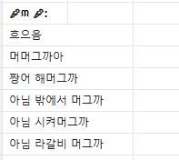
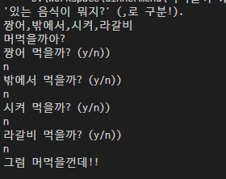

# DinnerMenu
Dinner Menu conversation
<br/><br/>

## Basic Idea
This code starts from this conversation
   >   
   >
   >  * Translation
   >
   >```
   >Hmmmm
   >What do you want for dinner?
   >Do you want to eat eel?
   >or Do you want to eat outside?
   >or Do you want to order delivery?
   >or Do you want to eat LA Galbi?
   >```
 
## Discription
 * First
   > Get data of food list (Including Delivery and eat ouside) </br>
   > Just type list of food (splited by , )
 
 * Second  
   > Algorithm will ask you which do you want to eat</br>
   > If you say "y" for yes, Algorithm will say "let's eat ㅁㅁ!"</br>
   > If you say "n" for no, Algorithm will ask another meal</br>
   > If you don't want to eat anything</br>
   > Algorithm will be angry!!!
   

## Result
  

